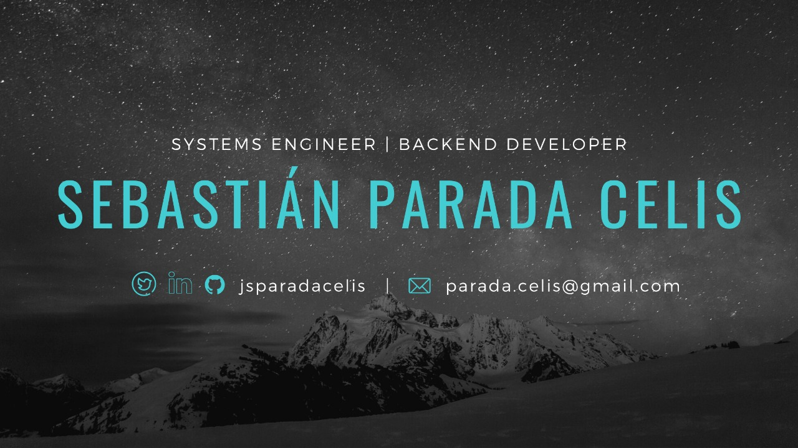

<h1>About me </h1>

 
I'm Sebastian from Bogotá, Colombia. I'm a curious person and a passionate about self-learning and ideas. I prefer to work with a cup of coffee on my desk and The Killers as soundtrack.
 
 
<h2> I usually play with </h2>

- :computer: Python, Go, JS.
- :earth_americas: Flask, FastAPI, Django, Angular.
- :microscope: Scikit-Learn, Pandas, Keras.

<h2>Talks & workshops</h2>

- [Epilepsy Diagnosis with Python](https://www.youtube.com/watch?v=ZmR1oQ_vYIg)
- [REST api with DRF](https://www.youtube.com/watch?v=z8nkWFGzSo4)
- [Django Rest Framework](https://2020.pycon.co/ponencias/30/)

<h2> Find me on </h2>

  
  
  

<h2> Let's talk! </h2>

